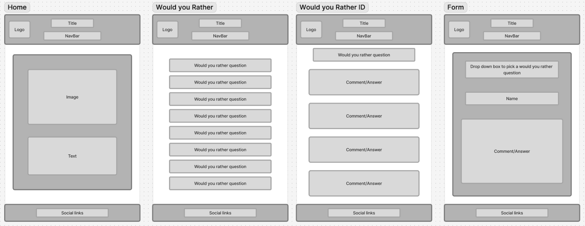

# Reflection

For this weeks assignment, I'm using Next.js to build a modern, dynamic website—specifically, a blog. The cool thing about using Next.js is how much it simplifies working with a database. It's designed for building efficient and scalable apps. I'm taking advantage of its backend integration capabilities, which means I can fetch and handle data directly within my pages, really streamlining the process of getting content onto the screen. I'm also setting up dynamic routing so that each blog post has its own unique page. I'll be using the params object in Next.js to make sure I fetch the correct data for the specific post the user is viewing.

Working with Next.js was quite fun and simple. It made working with the server, database, and extra pages really simpler, as you don't need to install any extra packages to make it all work, apart from PG (PostgreSQL). There were some things I feel like it put extra steps in, for example adding images and changing Google fonts. These two things especially I thought were easier to implement in React.

Now, I think as the weeks go on, things are starting to stick more and more. I don't feel like I need to go back to my notes for certain bits, but with each new assignment comes new implementations and new knowledge we have to implement. Where we are now within the course, it feels like we have hit a point where all we are doing is just adding a little bit extra on top and expanding a little on things we already know.

For this assignment, I thought I would try and give Trello a proper go for planning and setting out steps that needed doing, and it really helped my workflow. I don't feel like I hit a point of being confused or not knowing what to do, as I would give myself a task on Trello, and once that was done, I would take on another.

If there is anything you think I could do better or improve on, I'd be happy to listen and learn from what you have to say.

# Requirements

- ✅ 🎯 Display all posts on the page, with an option to sort them in ascending or descending order.
- ✅ 🎯 Create a SQL schema for a posts table and a comments table, with the comments being connected to the posts table with a foreign key.
  - Please submit your database schema, as is mentioned in the submission instructions.
- ✅ 🎯 Create a delete button on posts that allows users to delete the post from the database.
- ✅ 🎯 Create a form which saves comments to a dedicated comments table, with the comments being connected to the posts table with a foreign key.
- ✅ 🎯 Allow users to comment on individual posts in their dynamic routes. Comments should be associated with posts, and have a dynamic route (e.g. `/posts/:postid`).
- ✅ 🎯 Add a `redirect` when a user creates a post to redirect them to the posts page.

# Stretch Requirements

- ✅ 🏹 Create an edit functionality accessible via `/posts/:id/edit`, which pre-fills a form for post data. Create a working PUT route to update the post in the database.
- ✅ 🏹 Develop an edit comment feature accessible via `/posts/:id/comments/:id/edit`, which pre-fills a form for comment data. Create a working PUT route to update the comment in the database.
  - `docs/MannySaidItCounts.png`

# requirements that I wasn't able to achieve

- ❌ 🏹 Implement a `select` input (or similar mechanism) that allows users to categorise posts during creation, storing them in their own table in the database. Ensure appropriate routing for categories, with endpoints such as `/categories` and `/categories/:id` to enable users to browse and interact with posts by category.

# Wireframe

# What went really well and what could have gone better?

- If I'm honest, I feel like this assignment went quite well. I didn't run into any bugs or errors, which was quite nice. I feel like since week 4, we have kind of been doing the same assignment, but each week just keeps adding to it. It's like some of last week's stretch goals are now part of the MVP for this week's assignment.

- I know I have reused some of my styling on my form and edit pages.js, but I did that with the thought that if I add something to one of the pages and not the other, I would then have to give it its own styling, so I might as well do it now. I can see how Tailwind would be helping with things like this to future-proof your app.

# External sources

### Info

[My own repo](https://github.com/IndieMasco/TechEdSoftwareDeveloper021) , [Tech Ed repo](https://github.com/Tech-Educators/software-dev-021) , [FigJam](https://www.figma.com/board/JjN2Zgtoynrau06MjWJs6q/SD021?node-id=0-1&p=f&t=V1WCGcrmVKnoxJDr-0) , [MDN](https://developer.mozilla.org/en-US/) , [W3School](https://www.w3schools.com/) , [Template](https://github.com/Tech-Educators/software-dev-021/blob/main/demos/week6/week6-assignment/src/App.jsx) , [Next.js docs](https://nextjs.org/docs) , [Demo / Template](https://github.com/Tech-Educators/software-dev-021/tree/main/demos/week8/week8-assignment)
